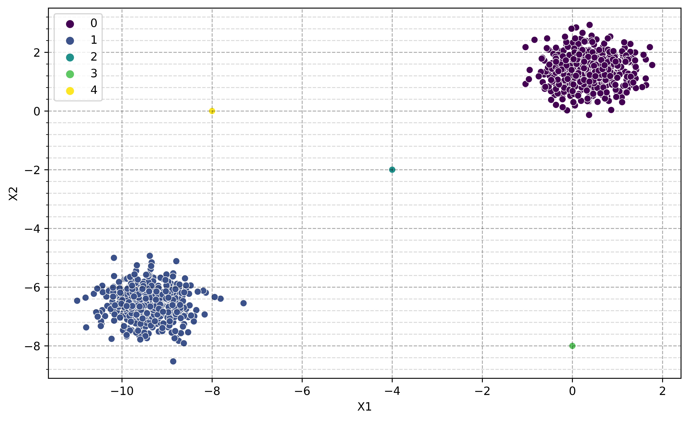

___

<a href='http://www.pieriandata.com'></a>
___
<center><em>Copyright by Pierian Data Inc.</em></center>
<center><em>For more information, visit us at <a href='http://www.pieriandata.com'>www.pieriandata.com</a></em></center>

# DBSCAN Hyperparameters


Let's explore the hyperparameters for DBSCAN and how they can change results!

## DBSCAN and Clustering Examples


```python
import numpy as np
import pandas as pd
import matplotlib.pyplot as plt
import seaborn as sns
from matplotlib.ticker import (AutoMinorLocator, MultipleLocator)
```


```python
def Std_Vis_Plot():
    fig, ax = plt.subplots(figsize=(10, 6),dpi=650)
    ax.yaxis.set_minor_locator(AutoMinorLocator(5))
    ax.grid(which='minor', color='black',alpha=0.15, linestyle='--')
    ax.grid(which='major', color='black',alpha=0.33, linestyle='--')
```


```python
two_blobs = pd.read_csv('../DATA/cluster_two_blobs.csv')
two_blobs_outliers = pd.read_csv('../DATA/cluster_two_blobs_outliers.csv')
```


```python
Std_Vis_Plot()
sns.scatterplot(data=two_blobs,x='X1',y='X2',palette='viridis')
```


    <AxesSubplot:xlabel='X1', ylabel='X2'>


```python
# plt.figure(figsize=(10,6),dpi=200)
Std_Vis_Plot()
sns.scatterplot(data=two_blobs_outliers,x='X1',y='X2',palette='viridis')
```


    <AxesSubplot:xlabel='X1', ylabel='X2'>


## Label Discovery


```python
def display_categories(model,data):
    labels = model.fit_predict(data)
    sns.scatterplot(data=data,x='X1',y='X2',hue=labels,palette='viridis')
```

## DBSCAN


```python
from sklearn.cluster import DBSCAN
```


```python
help(DBSCAN)
```

    Help on class DBSCAN in module sklearn.cluster._dbscan:
    
    class DBSCAN(sklearn.base.ClusterMixin, sklearn.base.BaseEstimator)
     |  DBSCAN(eps=0.5, *, min_samples=5, metric='euclidean', metric_params=None, algorithm='auto', leaf_size=30, p=None, n_jobs=None)
     |  
     |  Perform DBSCAN clustering from vector array or distance matrix.
     |  
     |  DBSCAN - Density-Based Spatial Clustering of Applications with Noise.
     |  Finds core samples of high density and expands clusters from them.
     |  Good for data which contains clusters of similar density.
     |  
     |  Read more in the :ref:`User Guide <dbscan>`.
     |  
     |  Parameters
     |  ----------
     |  eps : float, default=0.5
     |      The maximum distance between two samples for one to be considered
     |      as in the neighborhood of the other. This is not a maximum bound
     |      on the distances of points within a cluster. This is the most
     |      important DBSCAN parameter to choose appropriately for your data set
     |      and distance function.
     |  
     |  min_samples : int, default=5
     |      The number of samples (or total weight) in a neighborhood for a point
     |      to be considered as a core point. This includes the point itself.
     |  
     |  metric : string, or callable, default='euclidean'
     |      The metric to use when calculating distance between instances in a
     |      feature array. If metric is a string or callable, it must be one of
     |      the options allowed by :func:`sklearn.metrics.pairwise_distances` for
     |      its metric parameter.
     |      If metric is "precomputed", X is assumed to be a distance matrix and
     |      must be square. X may be a :term:`Glossary <sparse graph>`, in which
     |      case only "nonzero" elements may be considered neighbors for DBSCAN.
     |  
     |      .. versionadded:: 0.17
     |         metric *precomputed* to accept precomputed sparse matrix.
     |  
     |  metric_params : dict, default=None
     |      Additional keyword arguments for the metric function.
     |  
     |      .. versionadded:: 0.19
     |  
     |  algorithm : {'auto', 'ball_tree', 'kd_tree', 'brute'}, default='auto'
     |      The algorithm to be used by the NearestNeighbors module
     |      to compute pointwise distances and find nearest neighbors.
     |      See NearestNeighbors module documentation for details.
     |  
     |  leaf_size : int, default=30
     |      Leaf size passed to BallTree or cKDTree. This can affect the speed
     |      of the construction and query, as well as the memory required
     |      to store the tree. The optimal value depends
     |      on the nature of the problem.
     |  
     |  p : float, default=None
     |      The power of the Minkowski metric to be used to calculate distance
     |      between points. If None, then ``p=2`` (equivalent to the Euclidean
     |      distance).
     |  
     |  n_jobs : int, default=None
     |      The number of parallel jobs to run.
     |      ``None`` means 1 unless in a :obj:`joblib.parallel_backend` context.
     |      ``-1`` means using all processors. See :term:`Glossary <n_jobs>`
     |      for more details.
     |  
     |  Attributes
     |  ----------
     |  core_sample_indices_ : ndarray of shape (n_core_samples,)
     |      Indices of core samples.
     |  
     |  components_ : ndarray of shape (n_core_samples, n_features)
     |      Copy of each core sample found by training.
     |  
     |  labels_ : ndarray of shape (n_samples)
     |      Cluster labels for each point in the dataset given to fit().
     |      Noisy samples are given the label -1.
     |  
     |  Examples
     |  --------
     |  >>> from sklearn.cluster import DBSCAN
     |  >>> import numpy as np
     |  >>> X = np.array([[1, 2], [2, 2], [2, 3],
     |  ...               [8, 7], [8, 8], [25, 80]])
     |  >>> clustering = DBSCAN(eps=3, min_samples=2).fit(X)
     |  >>> clustering.labels_
     |  array([ 0,  0,  0,  1,  1, -1])
     |  >>> clustering
     |  DBSCAN(eps=3, min_samples=2)
     |  
     |  See Also
     |  --------
     |  OPTICS : A similar clustering at multiple values of eps. Our implementation
     |      is optimized for memory usage.
     |  
     |  Notes
     |  -----
     |  For an example, see :ref:`examples/cluster/plot_dbscan.py
     |  <sphx_glr_auto_examples_cluster_plot_dbscan.py>`.
     |  
     |  This implementation bulk-computes all neighborhood queries, which increases
     |  the memory complexity to O(n.d) where d is the average number of neighbors,
     |  while original DBSCAN had memory complexity O(n). It may attract a higher
     |  memory complexity when querying these nearest neighborhoods, depending
     |  on the ``algorithm``.
     |  
     |  One way to avoid the query complexity is to pre-compute sparse
     |  neighborhoods in chunks using
     |  :func:`NearestNeighbors.radius_neighbors_graph
     |  <sklearn.neighbors.NearestNeighbors.radius_neighbors_graph>` with
     |  ``mode='distance'``, then using ``metric='precomputed'`` here.
     |  
     |  Another way to reduce memory and computation time is to remove
     |  (near-)duplicate points and use ``sample_weight`` instead.
     |  
     |  :class:`cluster.OPTICS` provides a similar clustering with lower memory
     |  usage.
     |  
     |  References
     |  ----------
     |  Ester, M., H. P. Kriegel, J. Sander, and X. Xu, "A Density-Based
     |  Algorithm for Discovering Clusters in Large Spatial Databases with Noise".
     |  In: Proceedings of the 2nd International Conference on Knowledge Discovery
     |  and Data Mining, Portland, OR, AAAI Press, pp. 226-231. 1996
     |  
     |  Schubert, E., Sander, J., Ester, M., Kriegel, H. P., & Xu, X. (2017).
     |  DBSCAN revisited, revisited: why and how you should (still) use DBSCAN.
     |  ACM Transactions on Database Systems (TODS), 42(3), 19.
     |  
     |  Method resolution order:
     |      DBSCAN
     |      sklearn.base.ClusterMixin
     |      sklearn.base.BaseEstimator
     |      builtins.object
     |  
     |  Methods defined here:
     |  
     |  __init__(self, eps=0.5, *, min_samples=5, metric='euclidean', metric_params=None, algorithm='auto', leaf_size=30, p=None, n_jobs=None)
     |      Initialize self.  See help(type(self)) for accurate signature.
     |  
     |  fit(self, X, y=None, sample_weight=None)
     |      Perform DBSCAN clustering from features, or distance matrix.
     |      
     |      Parameters
     |      ----------
     |      X : {array-like, sparse matrix} of shape (n_samples, n_features), or             (n_samples, n_samples)
     |          Training instances to cluster, or distances between instances if
     |          ``metric='precomputed'``. If a sparse matrix is provided, it will
     |          be converted into a sparse ``csr_matrix``.
     |      
     |      sample_weight : array-like of shape (n_samples,), default=None
     |          Weight of each sample, such that a sample with a weight of at least
     |          ``min_samples`` is by itself a core sample; a sample with a
     |          negative weight may inhibit its eps-neighbor from being core.
     |          Note that weights are absolute, and default to 1.
     |      
     |      y : Ignored
     |          Not used, present here for API consistency by convention.
     |      
     |      Returns
     |      -------
     |      self
     |  
     |  fit_predict(self, X, y=None, sample_weight=None)
     |      Perform DBSCAN clustering from features or distance matrix,
     |      and return cluster labels.
     |      
     |      Parameters
     |      ----------
     |      X : {array-like, sparse matrix} of shape (n_samples, n_features), or             (n_samples, n_samples)
     |          Training instances to cluster, or distances between instances if
     |          ``metric='precomputed'``. If a sparse matrix is provided, it will
     |          be converted into a sparse ``csr_matrix``.
     |      
     |      sample_weight : array-like of shape (n_samples,), default=None
     |          Weight of each sample, such that a sample with a weight of at least
     |          ``min_samples`` is by itself a core sample; a sample with a
     |          negative weight may inhibit its eps-neighbor from being core.
     |          Note that weights are absolute, and default to 1.
     |      
     |      y : Ignored
     |          Not used, present here for API consistency by convention.
     |      
     |      Returns
     |      -------
     |      labels : ndarray of shape (n_samples,)
     |          Cluster labels. Noisy samples are given the label -1.
     |  
     |  ----------------------------------------------------------------------
     |  Data descriptors inherited from sklearn.base.ClusterMixin:
     |  
     |  __dict__
     |      dictionary for instance variables (if defined)
     |  
     |  __weakref__
     |      list of weak references to the object (if defined)
     |  
     |  ----------------------------------------------------------------------
     |  Methods inherited from sklearn.base.BaseEstimator:
     |  
     |  __getstate__(self)
     |  
     |  __repr__(self, N_CHAR_MAX=700)
     |      Return repr(self).
     |  
     |  __setstate__(self, state)
     |  
     |  get_params(self, deep=True)
     |      Get parameters for this estimator.
     |      
     |      Parameters
     |      ----------
     |      deep : bool, default=True
     |          If True, will return the parameters for this estimator and
     |          contained subobjects that are estimators.
     |      
     |      Returns
     |      -------
     |      params : dict
     |          Parameter names mapped to their values.
     |  
     |  set_params(self, **params)
     |      Set the parameters of this estimator.
     |      
     |      The method works on simple estimators as well as on nested objects
     |      (such as :class:`~sklearn.pipeline.Pipeline`). The latter have
     |      parameters of the form ``<component>__<parameter>`` so that it's
     |      possible to update each component of a nested object.
     |      
     |      Parameters
     |      ----------
     |      **params : dict
     |          Estimator parameters.
     |      
     |      Returns
     |      -------
     |      self : estimator instance
     |          Estimator instance.
    
    


```python
dbscan = DBSCAN()
```


```python
Std_Vis_Plot()
display_categories(dbscan,two_blobs)
```


```python
Std_Vis_Plot()
display_categories(dbscan,two_blobs_outliers)
```


# Epsilon

    eps : float, default=0.5
     |      The maximum distance between two samples for one to be considered
     |      as in the neighborhood of the other. This is not a maximum bound
     |      on the distances of points within a cluster. This is the most
     |      important DBSCAN parameter to choose appropriately for your data set
     |      and distance function.


```python
# Tiny Epsilon --> Tiny Max Distance --> Everything is an outlier (class=-1)
Std_Vis_Plot()
dbscan = DBSCAN(eps=0.001)
display_categories(dbscan,two_blobs_outliers)
```


```python
# Huge Epsilon --> Huge Max Distance --> Everything is in the same cluster (class=0)
Std_Vis_Plot()
dbscan = DBSCAN(eps=10)
display_categories(dbscan,two_blobs_outliers)
```


```python
# How to find a good epsilon?
Std_Vis_Plot()
dbscan = DBSCAN(eps=1)
display_categories(dbscan,two_blobs_outliers)
```


```python
dbscan.labels_
```


    array([ 0,  1,  0, ..., -1, -1, -1], dtype=int64)


```python
dbscan.labels_ == -1
```


    array([False, False, False, ...,  True,  True,  True])


```python
np.sum(dbscan.labels_ == -1) #Number of outliers
```


    3


```python
len(dbscan.labels_)
```


    1003


```python
print(f'Percentage of outliers = {np.round(100 * np.sum(dbscan.labels_ == -1) / len(dbscan.labels_),decimals=5)} %') #Percentage of outliers 
```

    Percentage of outliers = 0.2991 %
    

## Charting reasonable Epsilon values


```python
list_of_numbers=np.arange(start=0.01,stop=10,step=0.01)
```


```python
outlier_percent = []
number_of_outliers = []

for eps in list_of_numbers:
    
    # Create Model
    dbscan = DBSCAN(eps=eps)
    dbscan.fit(two_blobs_outliers)
    
    # Log Number of Outliers
    number_of_outliers.append(np.sum(dbscan.labels_ == -1))
    
    # Log percentage of points that are outliers
    perc_outliers = 100 * np.sum(dbscan.labels_ == -1) / len(dbscan.labels_)
    
    outlier_percent.append(perc_outliers)
    
```


```python
Std_Vis_Plot()
sns.lineplot(x=list_of_numbers,y=outlier_percent,color='blue')
plt.ylabel("Percentage of Points Classified as Outliers")
plt.axvline(x=0.75, color = 'r',alpha=0.3)
plt.xlabel("Epsilon Value")
```


    Text(0.5, 0, 'Epsilon Value')


```python
Std_Vis_Plot()
sns.lineplot(x=list_of_numbers,y=number_of_outliers,color='blue')
plt.ylabel("Number of Points Classified as Outliers")
plt.xlabel("Epsilon Value")
plt.axvline(x=0.75, color = 'r',alpha=0.3)
plt.xlim(0,1)
```


    (0.0, 1.0)


### Do we want to think in terms of percentage targeting instead?

If so, you could "target" a percentage, like choose a range producing 1%-5% as outliers.


```python
Std_Vis_Plot()
sns.lineplot(x=list_of_numbers,y=outlier_percent,color='blue')
plt.ylabel("Percentage of Points Classified as Outliers")
plt.xlabel("Epsilon Value")
plt.ylim(0,5)
plt.xlim(0,2)
plt.axvline(x=0.39, color = 'r',alpha=0.3)
plt.axhline(y=1, color = 'r',alpha=0.3)
```


    <matplotlib.lines.Line2D at 0x26093c1de48>


```python
# How to find a good epsilon?
Std_Vis_Plot()
dbscan = DBSCAN(eps=0.4)
display_categories(dbscan,two_blobs_outliers)
```


### Do we want to think in terms of number of outliers targeting instead?

If so, you could "target" a number of outliers, such as 3 points as outliers.


```python
Std_Vis_Plot()
sns.lineplot(x=list_of_numbers,y=number_of_outliers,color='blue')
plt.ylabel("Number of Points Classified as Outliers")
plt.xlabel("Epsilon Value")
plt.ylim(0,10)
plt.xlim(0,6)
plt.hlines(y=3,xmin=0,xmax=10,colors='red',ls='--')
```


    <matplotlib.collections.LineCollection at 0x26092a4b848>


```python
# How to find a good epsilon?
Std_Vis_Plot()
dbscan = DBSCAN(eps=0.75)
display_categories(dbscan,two_blobs_outliers)
```


## Minimum Samples

     |  min_samples : int, default=5
     |      The number of samples (or total weight) in a neighborhood for a point
     |      to be considered as a core point. This includes the point itself.
     

How to choose minimum number of points?

https://stats.stackexchange.com/questions/88872/a-routine-to-choose-eps-and-minpts-for-dbscan


```python
second_list_of_numbers=np.arange(1,100,step=1)
```


```python
second_outlier_percent = []

for n in second_list_of_numbers:
    
    # Create Model
    dbscan = DBSCAN(min_samples=n)
    dbscan.fit(two_blobs_outliers)
    # Log percentage of points that are outliers
    perc_outliers = 100 * np.sum(dbscan.labels_ == -1) / len(dbscan.labels_)
    second_outlier_percent.append(perc_outliers)
    
```


```python
Std_Vis_Plot()
sns.lineplot(x=second_list_of_numbers,y=second_outlier_percent,color='blue')
plt.axvline(x =2, color = 'r',alpha=0.3)
plt.axvline(x =13, color = 'r',alpha=0.3)
plt.ylabel("Percentage of Points Classified as Outliers")
plt.xlabel("Minimum Number of Samples")
```


    Text(0.5, 0, 'Minimum Number of Samples')


```python
Std_Vis_Plot()
num_dim = two_blobs_outliers.shape[1]
dbscan = DBSCAN(min_samples=2*num_dim)
display_categories(dbscan,two_blobs_outliers)
```


```python
Std_Vis_Plot()
num_dim = two_blobs_outliers.shape[1]
dbscan = DBSCAN(eps=0.75,min_samples=2*num_dim)
display_categories(dbscan,two_blobs_outliers)
```


```python
Std_Vis_Plot()
dbscan = DBSCAN(min_samples=1)
display_categories(dbscan,two_blobs_outliers)
```


```python
Std_Vis_Plot()
dbscan = DBSCAN(eps=0.75,min_samples=1)
display_categories(dbscan,two_blobs_outliers)
```





----
